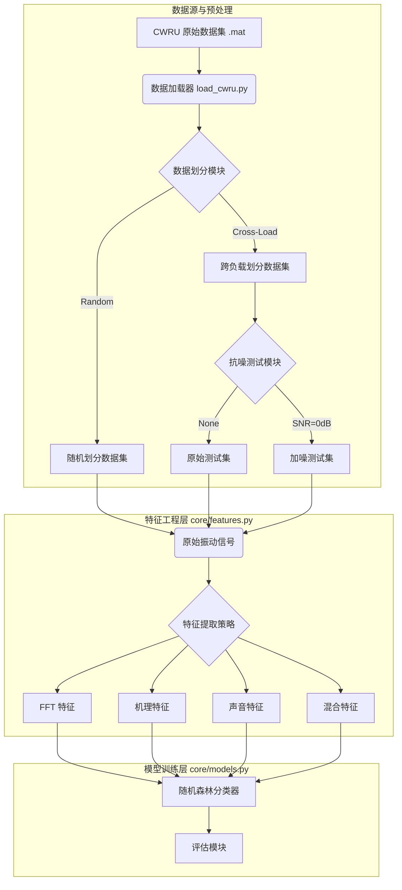

# 阶段一实验成果总结报告

**日期**: 2025年11月30日  
**负责人**: 孙王瑜  
**项目**: 设备故障诊断智能模型（机理模型项目）

---

## 1. 实验目标
本阶段旨在构建模块化的故障诊断实验平台，基于 CWRU 开源数据集，验证不同特征提取方法（FFT、机理特征、声音特征）在随机森林模型下的性能，并重点评估模型在**跨工况（Cross-Load）**和**强噪声（High Noise）**环境下的泛化能力与鲁棒性，为后续引入 Transformer 模型提供实验依据。

## 2. 实验平台架构

本阶段完成了模块化实验平台的搭建，支持灵活切换特征提取器、数据划分模式及抗噪测试。

### 2.1 系统框架图

## 3. 实验结果与分析

### 3.1 跨工况测试 (Cross-Load Evaluation)
*训练集：0, 1, 2 HP | 测试集：3 HP*

| 特征类型 | 维度 | 准确率 (Accuracy) | 结论 |
| :--- | :--- | :--- | :--- |
| **FFT (基准)** | 2050 | **96.93%** | 在无噪声环境下，FFT 表现出极强的鲁棒性，几乎不受转速微变影响。 |
| **机理特征** | 12 | **68.21%** | 受转速偏差影响较大，单一机理特征难以应对工况变化。 |
| **混合特征** | 2062 | **97.21%** | **最优结果**。机理特征作为补充信息，微幅提升了模型性能。 |

### 3.2 抗噪测试 (Noise Robustness)
*测试集信噪比 SNR = 10dB (中等噪声) 和 0dB (强噪声)*

| 特征类型 | 无噪声准确率 | 10dB 噪声准确率 | 0dB 噪声准确率 | 性能跌幅 (0dB) |
| :--- | :--- | :--- | :--- | :--- |
| **FFT 模型** | 96.93% | **68.69%** | **36.59%** | **-60.3%** (严重失效) |
| **机理模型** | 68.21% | **50.46%** | - | - |
| **混合模型** | 97.21% | **70.23%** | **40.44%** | **-56.8%** (略有缓解) |

### 3.3 关键发现
1.  **CWRU 数据集的“虚高”现象**：在洁净数据下，FFT 模型能达到 97% 的准确率，但这掩盖了其抗噪性差的缺陷。
2.  **FFT 的脆弱性**：
    *   在 **10dB 中等噪声**下，FFT 模型准确率从 97% 跌至 68%，已经开始显现不稳定性。
    *   一旦引入 **0dB 强噪声**，准确率断崖式下跌至 36%，无法满足真实工业场景需求。
3.  **机理特征的价值**：
    *   在 10dB 噪声下，混合模型 (70.23%) 依然优于纯 FFT 模型 (68.69%)。
    *   在 0dB 强噪声下，混合模型比纯 FFT 模型高出 **4%**，证明了物理先验知识在恶劣环境下的鲁棒性价值。

## 4. 下一阶段计划 (Next Steps)

基于本阶段实验暴露出的问题（抗噪性差、机理特征利用率低），下一阶段将重点开展以下工作：

1.  **声音特征实装**：
    *   对接姚飞提供的声音转换算法，替换目前的模拟 PSD/RMS 特征，验证“以声代振”的可行性。
2.  **引入 Transformer 模型**：
    *   **目标**：解决强噪声（0dB）下准确率低的问题。
    *   **方案**：利用 Transformer 的自注意力机制（Self-Attention）捕捉长距离依赖，结合去噪自编码器（Denoising Autoencoder）思想，从强噪声中恢复故障特征。
3.  **优化机理融合**：
    *   不再简单拼接，而是将机理特征作为 Transformer 的 **Positional Encoding** 或 **Attention Mask**，深度融合物理知识。

---
*文档生成时间: 2025-11-30*
